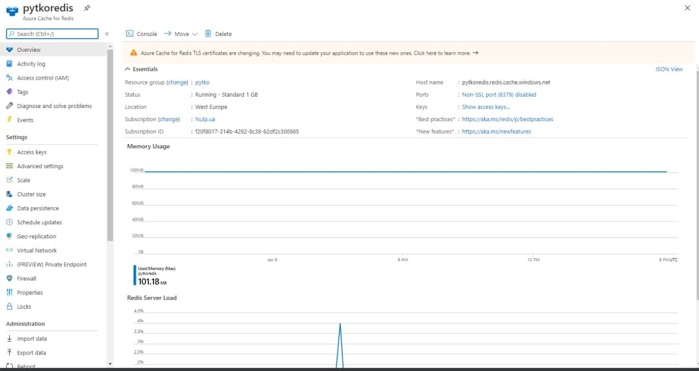
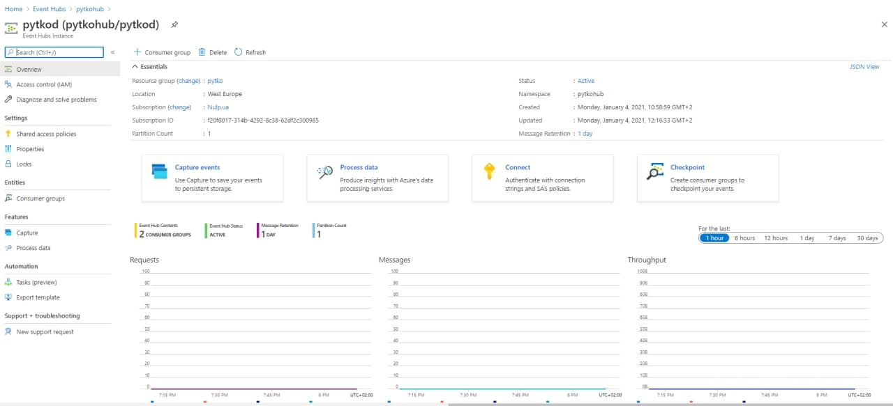
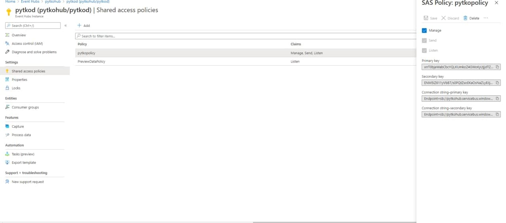
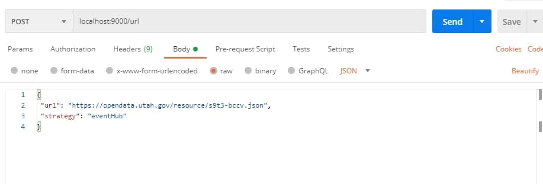
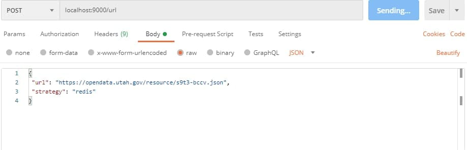
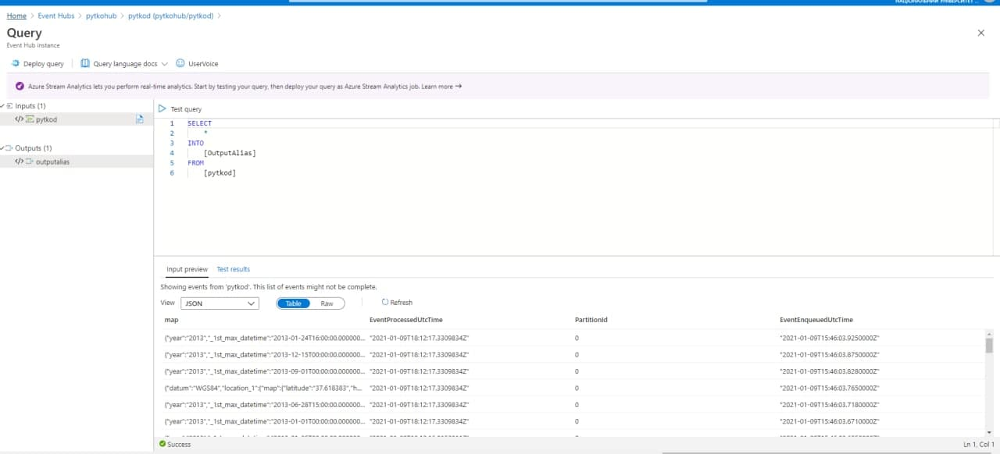
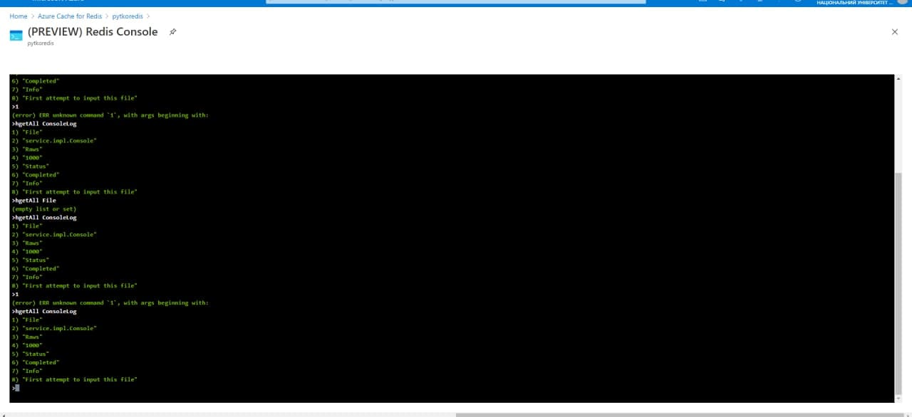

# LAB 5

# Prerequisites
- Акаунт на azure
- Java
- Maven
- Postman

# Azure Prepararion
 Для початку потрібно підключити azure subscription, щоб доступний увесь функціонал
 1. Створюємо resource group, до якої прив'язуватимуться усі наші сервіси.
 2. Створюємо Redis Cache Instance.
  2a.Створюємо Shared Access Policy для генерації Connection String та Primary Key, що слугуватимуть як дані для надання доступу до нашого ресурсу з боку Jedis і його програмного виклику.
  
 3. Створюємо Event Hub Namespace.
 
   3a. Створюємо дочірній Event Hub Instance.
   
   3b. Створюємо також Shared Access Policy для генерації Connection String та Primary Key, що слугуватимуть як дані для авторизації клієнта і його програмного виклику.
   

# Project Customization And Setup
 1. Вставте необхідні дані в файл ``` sh src\main\java\com\lab5\resteventhub\service\ SendDataConsoleImpl та SendDataEventhubimpl (CACHE_HOSTNAME, CACHE_KEY, MAP_NAME, FILE_NAME, NamespaceName, EventHubName, SasKeyName, SasKey) ```
 2. Запускаємо апку напряму в src\main\java\com\lab5\resteventhub\RestEventHubApplication

# Project Execution
 Для завантаження даних в Event Hub або Redis, необхідно виконати POST запит до ```sh localhost:9000/url ``` із відповідним request body. Це можливо зробити за допомогою:
  Postman - встановлюємо значення application/json для хедера Content-Type і додаємо валідне тіло запиту:
       ``` sh {
        "url": "https://XXX/YYY.json",
        "strategy": "eventHub|redis"
       } ```
       
       
 
 Програма логуватиме усі необхідні дані відповідно до логіки задачі. Для перевірки надісланих даних:
  1. Event Hub Ваш Event Hub > Features > Proccess Data > Explore
  
  2. Redis Ваш Redis Cache > Console > команда hgetAll ConsoleLog
  

