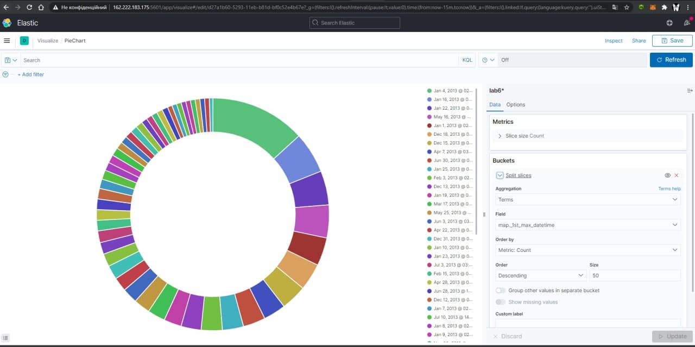
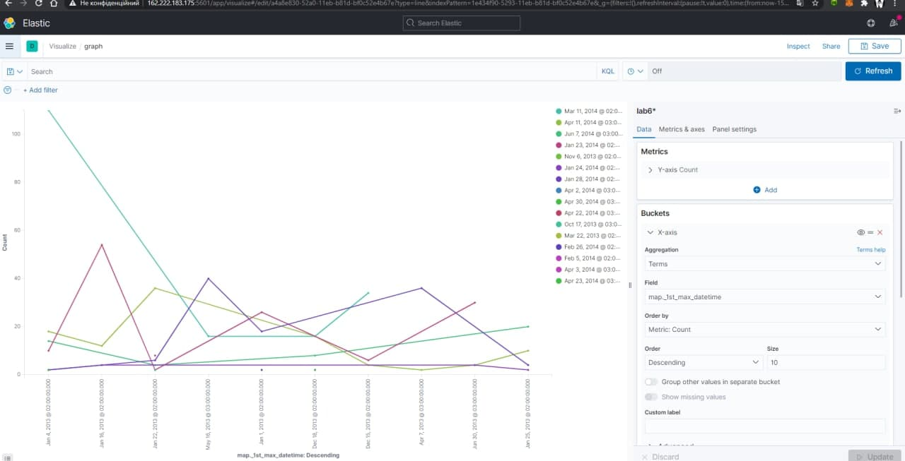
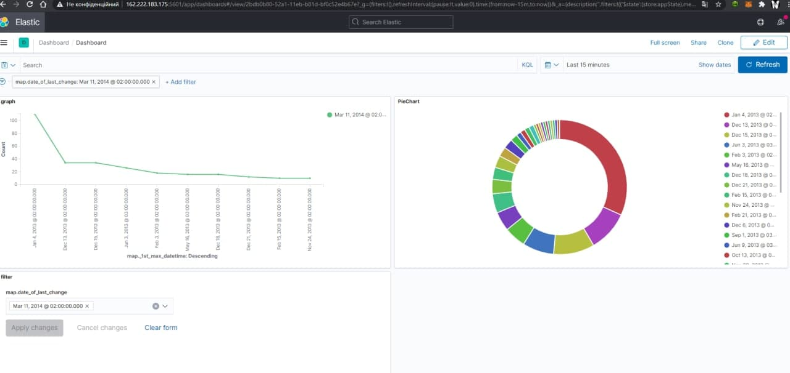
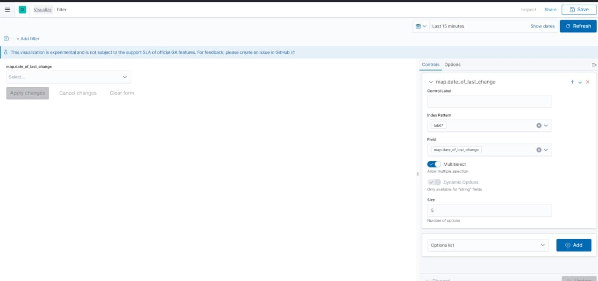

# Lab 7
# Prerequisites
  - Робочий інстанс Kibana
  - Існуючий каталог з валідними даними

# Data vizualization
1. Заходимо в розділ Vizualize.
2. Обираємо необхідний тип для відображення даних на основі необхідного поля.

   2a. Створюємо Pie Chart.
 
   2b. Створємо лінійний графік
 
3. Створюємо у розділі Dashboard дошку, де будуть обрані нами графіки, додаємо їх.
 
 
4.Наш фільтр

