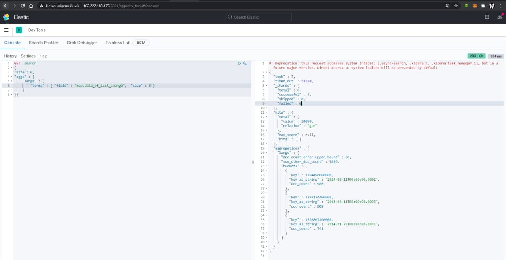

# Lab 7
# Prerequisites
  - Робочий інстанс Kibana
  - Існуючий каталог з валідними даними

# Data vizualization
1. Заходимо в розділ Vizualize.
2. Обираємо необхідний тип для відображення даних на основі необхідного поля.

   2a. Створюємо Pie Chart.
 
   2b. Створємо лінійний графік
 
3. Створюємо у розділі Dashboard дошку, де будуть обрані нами графіки, додаємо їх.
 
 
4.Наш фільтр


# Kibana DevTools

1. Топ-3 за полем map.date_of_last_change
```
GET _search
{
"size": 0,
"aggs" : {
    "langs" : {
        "terms" : { "field" : "map.date_of_last_change",  "size" : 3 }
    }
}}
```



2. Фільтрація записів за датою
```
GET _search
{
  "query": {
    "bool": {
      "filter": {
        "bool": {
          "must": [
            {
              "range": {
                "map.date_of_last_change": {
                  "gt": "2014-03-11T00:00:00.000Z",
                  "lte": "2015-03-11T00:00:00.000Z"
                }
              }
            }
          ]
        }
      }
    }
  }
}
```

![2(../img/7/2.png)

![3(../img/7/3.png)